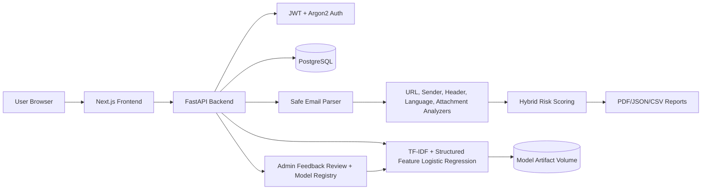

# PhishGuard Architecture

The backend never executes attachments, never visits suspicious URLs during core analysis, blocks remote email content in sanitized previews, and stores feedback as pending until an administrator approves it.

## Product Workflow

- **Dashboard:** live operational overview with seven-day activity, current risk buckets, recent analyses, common indicators, and service alerts.
- **Analyzer:** accepts pasted email content, common email/document uploads, URL checks, and raw headers while keeping advanced fields out of the main workflow.
- **Results:** presents risk score, model confidence, clear reasoning, compact details, sanitized preview, and reviewed feedback submission.
- **History:** supports searching, filtering, re-analysis, deletion, CSV export, and details links without changing the original analysis records.
- **Reports:** uses weekly grouped analysis volume and phishing counts so low-volume percentage spikes do not mislead trend interpretation.
- **Admin:** separates overview, users, feedback queue, model/dataset, audit logs, and system health; accepted feedback becomes the verified dataset for future model training.

## Deployment Notes

Local and Docker deployments can seed the first administrator from environment variables: `AUTO_SEED_ADMIN`, `ADMIN_EMAIL`, `ADMIN_PASSWORD`, and `ADMIN_FULL_NAME`. Model training remains disabled until enough approved feedback samples exist for a meaningful candidate model review.
